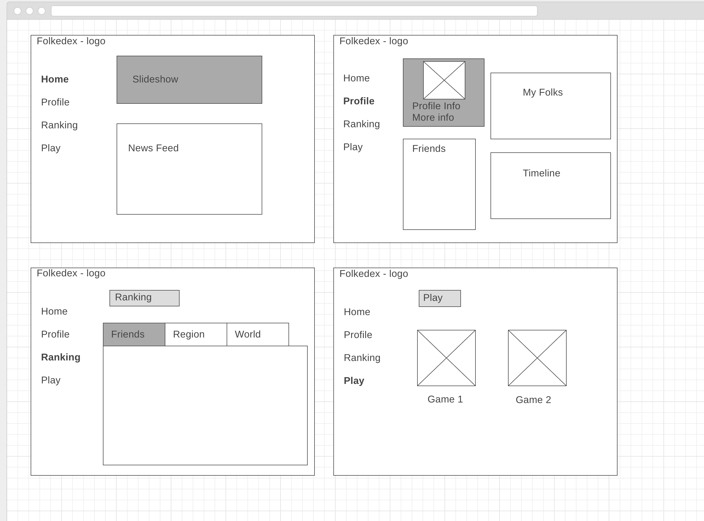

# Folkedex
Gotta snap 'em all

 

## UserStories
* **Given I am on any page on web app, when I click on take picture button I am taken to the take picture page.**
* **Given I am on the take picture page, when I click the take picture button a photo is taken.**
* **Given of picture is taken, when I look at the screen I have the option to discard or use photo .**
* **Given the option to discard or use photo, when I click discard the picture is deleted and I am taken back to the camera screen .**
* **Given the option to discard or use photo, when I click use this photo is uploaded and I see information about the person.**
* **Given I am on the home screen, when I click profile then my profile comes up.**
* **Given I am on my profile page, when I look at the top left I can see my info and display pic / Avatar.**
* **Given I am on my profile page, when I look below my info then I see my list of friends.**
* **Given I am on my profile page, when I look to the right of my friends list ice then I see my folks.**
* **Given I am on any page, when I click ranking then I am taking to the ranking page.**
* **Given I am on the ranking page, when I look at the screen I see my regional ranking and options to see my worldwide ranking and ranking among friends.**

---

## Technologies used:
* **Node.js**
* **Express**
* **Passport Authentication**
* **Microsoft Azure Computer Vision API**
* **React**

---

## How to use the app:
Log-in to app.
Inside the app you'll have the ability to:
  - Find other users
  - Request/Accept requests from other users
  - See profile with profile pic, friends and folks.
  - Reach the page where photos can be uploaded via url.
  - Navigate to Ranking page to see rankings
  - Navigate to Play page to play games
  - Logout

---

## Approach taken:
I worked on the database and backend first. This process went quite smoothly.
Once developed what data the backend will store and send, I worked on the front-
end. The front end took up the majority of my time.

---

## Unsolved problems:
Working out bugs with routing, especially to render the Profile component for
different users.

Getting the homepage slideshow to work was unresolved at the time of submission.
However, I did some research and there is a react-slick package that makes
implementing a slideshow very easily.

---

## Notes to self:
* Tryout react-slick for the slideshow.
* Get camera and image save working.
* Try Cloudinary for image hosting.
* Work on react-native version of this.
